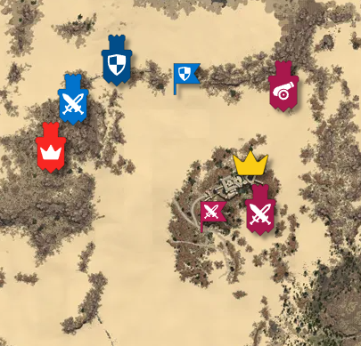

# bdo-seiges

<div align="center" width="100%">
  
</div>

Интерактивная карта для стадии планировани осад в Black Desert Online. Позволяет разместить на игровой карте различные объекты для визуализации процесса осады. [Приложение можно попробовать здесь](https://sieges.exi.moe/)

## Сборка

```bash
npm i && npm run build
```

## Docker

```bash
docker build -t sieges .
docker run -p 80:80 sieges
```

## Результаты осад

В проекте присутствует `/public/result.json` - это ответ от игрового API

```bash
curl --location 'https://game.ru.playblackdesert.com/GuildRank/Index/GetGuildRankList' \
--header 'User-Agent: BlackDesert' \
--form 'rankingType="1"' \
--form 'page="1"' \
--form 'pageLength="255"'
```

Вы можете настроить cron для получения данных после завершения осад

```bash
5 22 * * 0-5 curl --location 'https://game.ru.playblackdesert.com/GuildRank/Index/GetGuildRankList' \
--header 'User-Agent: BlackDesert' \
--form 'rankingType="1"' \
--form 'page="1"' \
--form 'pageLength="255"' > /var/www/your/path/to/project/result.json
```
